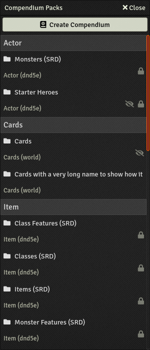
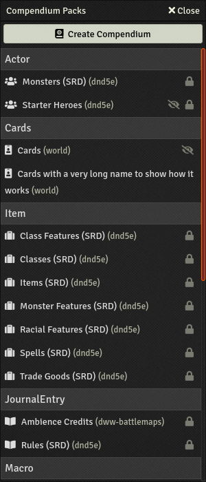

Better UI for the compendium packs tab. Clearer and more compact.

This module could almost be without JS and be CSS only but, sadly, it's needed because the "lines" in the compendium tab have no CSS class (or attribute) saying what their type is. The only way to detect that is to use the title of the category which can't be done in CSS. So JS is used to detecte those category titles and add a appropriate CSS class that the CSS file can use after.